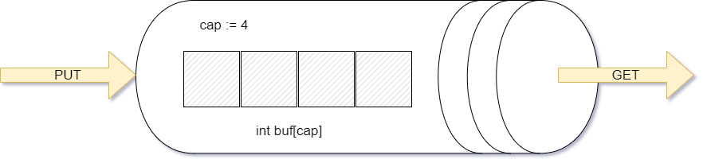
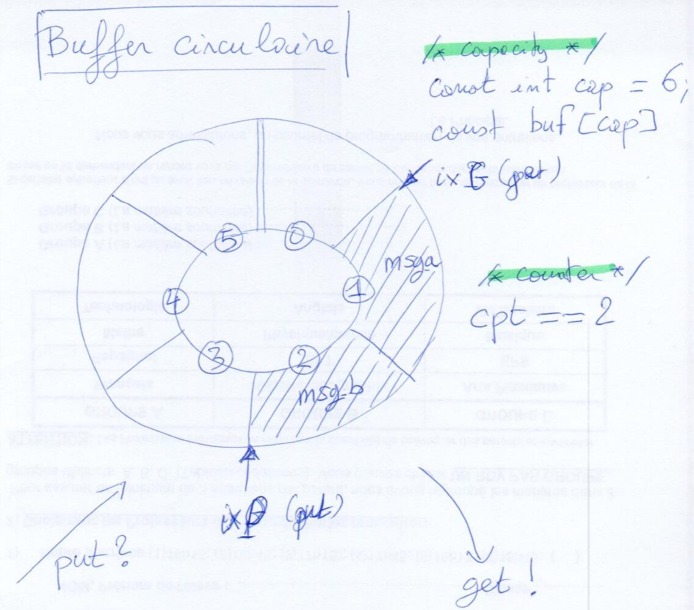
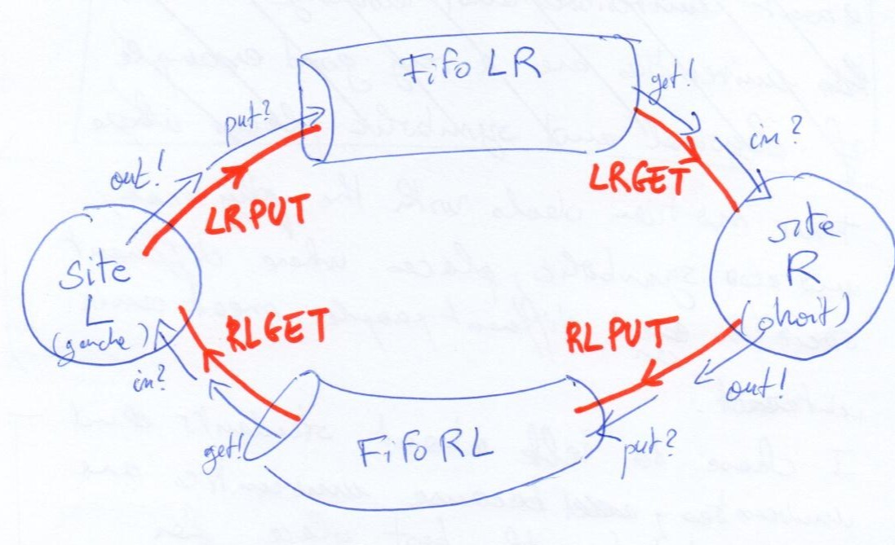

# TP2:  problème du choix distant en asynchrone

Dans la séance précédente vous avez vu comment créer de nouveaux _templates_ (de processus); déclarer des variables; utiliser les _gardes_ et les _updates_ (mises à jour) dans les transitions pour simuler le passage de valeurs dans les communications.

Dans cette nouvelle séance, vous allez étudier plus profondément la notion _d’instanciation_  de système. L’objectif est de modéliser le comportement d’un système communicants au-dessus d’un réseau asynchrone, à capacité bornée, dans lequel les messages ne peuvent pas se dépasser (FIFO).

## Le process Fifo

le process `fifo`  modélise le comportement d’un canal de communication FIFO à capacité (`cap`) finie.

```uppaal
process fifo(const int cap, chan &get, chan &put,  int &vget,  int &vput){
        int cpt := 0;
        int buf[cap];
        int ixP := 0;
        int ixG := 0;

        state service, erreur;

    	init service;
        
    	trans
        service -> service{
                guard cpt > 0;
                sync get!;
                assign vget:= buf[ixG], 
                cpt:= cpt - 1, ixG:= (ixG == (cap - 1))?0:(ixG + 1);
        },
        service -> service{
                guard cpt < cap;
                sync put?;
                assign buf[ixP]:= vput, cpt:= cpt + 1, 
                ixP:= (ixP == (cap - 1))?0:(ixP + 1);
        }; 
      
}
```

Une instance de `fifo`contient un buffer (`buf`) de capacité `cap` , un compteur du nombre de message contenu dans `buf` (la variable `cpt`) et deux canaux en paramètres qui définissent les _services_ du composant: `put` pour ajouter un message et `get`pour récupérer le message le plus ancien. Chacun de ces services est associé à une variable, `vput` et `vget`, qui sert à communiquer une valeur lors d’une synchronisation.


<figure>
  
  <figcaption>Fig. 1: Le composant FIFO</figcaption>
</figure>


La fifo se comporte comme un _buffer circulaire_; on écrit à la position `ixP` et on lit à la position `ixG`. On n’efface jamais les messages écrit mais on peut réécrire dessus.


<figure>
  
  <figcaption>Fig. 2: Buffer circulaire</figcaption>
</figure>


## Le système “choix asynchrone”

Le système global est constitué de deux instances de `fifo`et deux instances du composant `site`. Un site peut émettre (sur le canal `out` en utilisant la variable `vout` ) ou recevoir (sur `in`).


```uppaal
chan LRGET, LRPUT;
int  LRVG,  LRVP;

chan RLGET, RLPUT;
int  RLVG,  RLVP;

process site(chan &in, chan &out, int &vin, int &vout){ ... }

process fifo(const int cap, chan &get, chan &put,  int &vget,  int &vput){ ... }

FifoLR  := fifo(4,LRGET,LRPUT,LRVG,LRVP);
FifoRL  := fifo(4,RLGET,RLPUT,RLVG,RLVP);

gauche := site(RLGET,LRPUT,RLVG,LRVP);
droit :=  site(LRGET,RLPUT,LRVG,RLVP);

system gauche, FifoLR, FifoRL, droit;
```


En suivant les déclarations, on voit que le canal (paramètre) `out` de l’instance `gauche` de `site` est `LRPUT`, qui est aussi le canal `put` de l’instance `FifoLR` de `fifo`. Donc le site gauche émet ses messages dans FifoLR, et ces messages arriveront éventuellement sur un `in?` du site droit.

On peut illustrer ces relations à l’aide d’un schéma comme celui en Fig. 3.

<figure>
  
  <figcaption>Fig. 3: instantiation du système choixasync</figcaption>
</figure>
