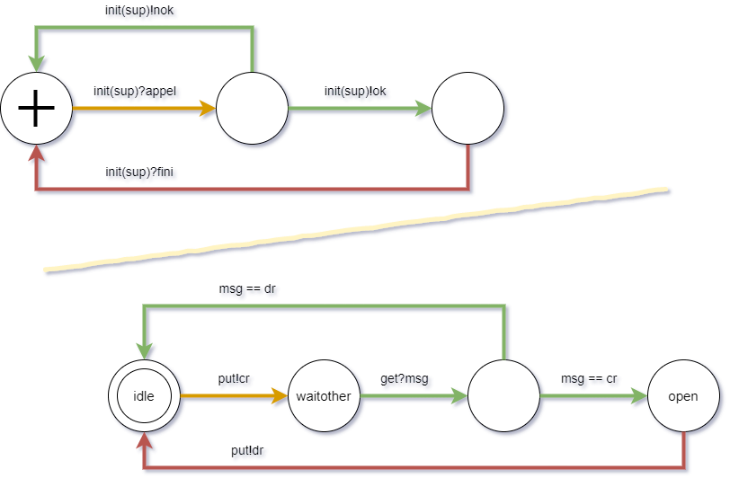

# TP3: protocole de communication  

On s’intéresse ici à la conception de système de télécommunications, du type protocoles téléphoniques, qui assurent la connexion et la déconnexion de session entre deux utilisateurs.

Ici on suppose que votre réseau n’a que deux utilisateurs

<p><a href="https://commons.wikimedia.org/wiki/File:Tr%C3%A5dtelefon-illustration.png#/media/Fichier:Trådtelefon-illustration.png"></a><br>This is from Project Runeberg book called <a rel="nofollow" class="external text" href="http://runeberg.org/huru/0081.html">The key to science</a> In swedish., Domaine public, <a href="https://commons.wikimedia.org/w/index.php?curid=472708">Lien</a></p>

On réutilise le “réseau FIFO” de la séance précédente. Au lieu de faire communiquer deux sites, on met en relation un processus `initiateur` (une instance du template `initia`) avec un processus `repondeur` (une instance du template `resp`).


```uppaal
FifoIR  := fifo(4,FIRGET,FIRPUT,PFIR,GFIR);
FifoRI  := fifo(4,FRIGET,FRIPUT,PFRI,GFRI);

repondeur := resp(FIRGET,FRIPUT,PFRI,GFIR);
initiateur := initia(FRIGET,FIRPUT,PFIR,GFRI);

system initiateur, FifoIR, FifoRI,  repondeur;
```


On considère deux type de message possibles, c’est-à-dire deux valeurs possibles pour les messages écrit dans le buffer des FIFO  (alors que, typiquement, on ne transmettait que la valeur 5 dans le TP 2). La valeur `cr`  correspond à un _call request_;  `dr` (pour drrriiiiiing ?) correspond à un _drop request_ , qui signale la fin ou le refus d’une session.


```uppaal
const int cr = 1;
const int dr = 0;
```


Au cours des questions du TP, le comportement de chaque service est décrit à l’aide de schémas, ou _automates de services_. Je donne ci-dessous une idée de la correspondance entre un automate et “l’équivalent” en UPPAAL (où on a simplifié la notion des communications). 


<figure>
  
  <figcaption>Fig. 1: correspondance entre "automates de services" et UPPAAL</figcaption>
</figure>

> __Remarque:__  un processus qui implante un automate de service, par exemple `initiateur`, doit envoyer un message (par exemple `sync put!; assign vput :=cr;`) lorsque le service attend de recevoir un “call request”  (la transition est `init(sup)? appel`). Ne soyez donc pas surpris si vous pensez que les polarités sont inversées dans ces schémas.

